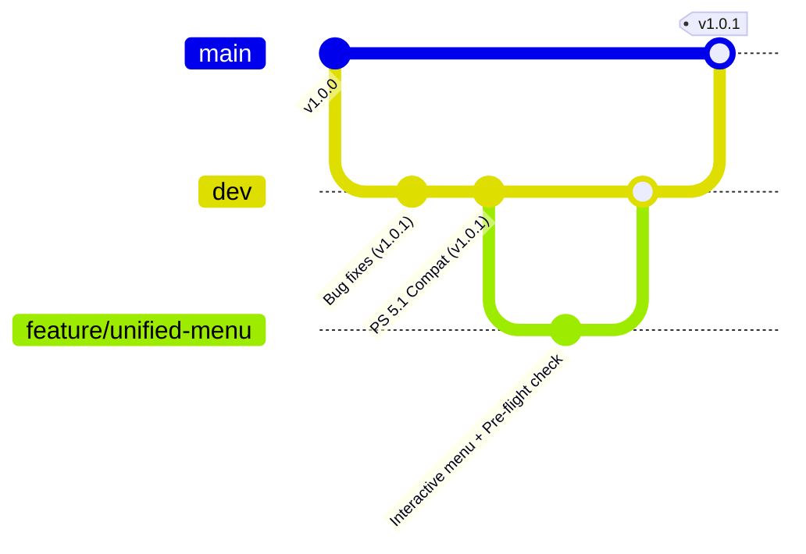

# Git Workflow & Contributing Guide | Guide de Contribution

## 🌐 English / Français

### 🌿 Branch Strategy | Stratégie de Branches
- **`main`** : Branche de production. Toujours stable et testée. S'exécute chez les clients en Zéro-LAN.
- **`dev`** : Branche d'intégration (Staging). Vérification manuelle requise avant la fusion vers main.
- **`feature/*`** : Branches courtes pour les nouvelles fonctionnalités (ex: `feature/unified-menu`).
- **`hotfix/*`** : Corrections urgentes de bugs (ex: `hotfix/ps51-compat`).

### 🔄 Merge Cycle | Cycle de Fusion
1. **Features** : Créées à partir de `dev` → Fusionnées dans `dev` via Pull Request / Merge Request.
2. **Staging** : Une fois `dev` validé, il est fusionné dans `main` (Production release).
3. **Hotfixes** : Créés à partir de `main` → Fusionnés directement dans `main`, puis rétro-fusionnés dans `dev`.

### 🏷️ Naming Conventions | Conventions de Nommage
- **Features** : `feature/description`
- **Hotfixes** : `hotfix/description`
- **Maintenance** : `chore/update-readme`

### 📊 Workflow Diagram (v1.0+) / Schéma du Workflow

